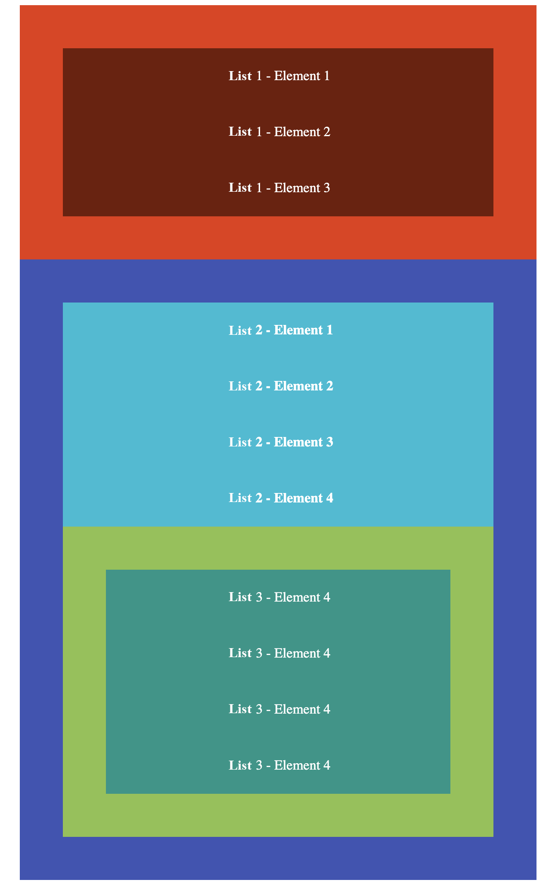

## Hausaufgabe

In der Datei `index.html` ist eine Website vorgegeben - ändern Sie zur Bearbeitung dieser Hausaufgabe **nur** CSS-Code
in der Datei `css/style.css`!
 

Erstellen Sie die folgenden drei globalen Variablen:
  - Eine Variable zur Ablage des `padding`-Wert `50px`
  - Eine Variable zur Ablage des Höhenwerts `35px`
  - Eine Variable zur Ablage der Farbe `#8bc34a`
  
 

- Definieren Sie für ***alle Listen*** auf der Website einen inneren Abstand von `50px` unter Verwendung der vorab
definierten Variablen.

- Legen Sie fest, dass Textelemente `50px` hoch sein sollen (verwenden Sie dazu die vorab definierte Variable und die 
Funktion `calc()`).

- *Zentrieren* Sie die vorkommenden Texte.

 

Stellen Sie nun folgende Hintergrundfarben ein:
- ***erste Liste***: `#e8370e` und für die in ihr enthaltenen Elemente die Farbe `#711c08`
- ***zweite Liste***: `#3f51b5` und für die in ihr enthaltenen Elemente die Farbe `#00bcd4`
- ***dritte Liste***: der vorab als Variable definierter Farbcode und die Farbe `#009688` für enthaltene Elemente

 

Sorgen Sie außerdem für:
- die Textfarbe `weiß` auf der gesamten Website
- ein ***fontweight*** von `400` für die ***erste Liste***
- ein ***fontweight*** von `700` für die ***zweite Liste***
- ein ***fontweight*** von `400` für die ***dritte Liste***

 

- Deaktivieren Sie darüber hinaus die Aufzählungszeichen der Listen!

 

Erwartetes Ergebnis:

