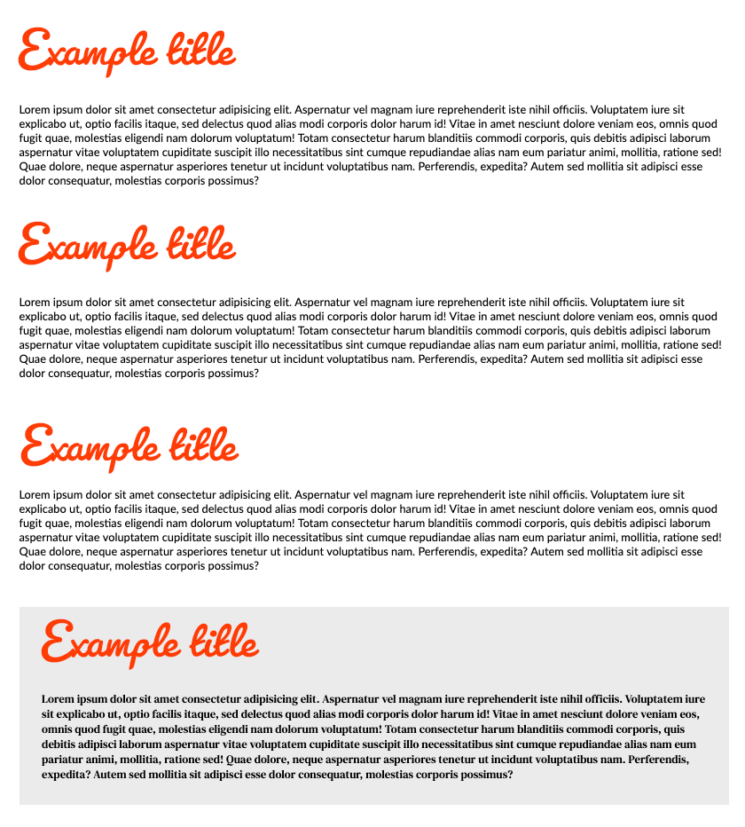

## Teil 1 - zu lösen mit dem Kursleiter

Das Font-Verzeichnis (`fonts`) enthält die Datei `Lato-Regular.ttf`.

- Besuchen Sie die Website [Font Squirrel](https://www.fontsquirrel.com/tools/webfont-generator) und lassen Sie sich
diese Font in eine ***Webfont*** umwandeln (Option `OPTIMAL`, Einverständnis ist gegeben).

 

- Laden Sie die resultierenden Webfonts auf Ihren Computer, entpacken Sie das Archiv und fügen Sie die `woff`- und
`woff2`-Dateien im `fonts`-Ordner ab.

 

- Erstellen Sie eine entsprechende `@font-face`-Styling-Regel für die Webfont.

- Stellen Sie eine ***generische fallback-Font*** für Texte auf der gesamten Website ein.

---

 

## Teil 2 - selbstständig zu lösen

Besuchen Sie die Website [Google Fonts](https://www.google.com/fonts) und führen Sie folgende Schritte aus:

- Wählen Sie über die Suchmaschine auf der rechten Seite die Schriftart **Pacifico** aus (`Select this style`).
 
Auf der rechten Seite wird HTML-Quellcode angezeigt (sofern `&gt;link&lt;` angewählt ist), der die ausgewählte Font
automatische einbinden.

- Mittels `font-family` sollen alle Überschriften (`h1` und `h2`) mit dieser Schriftart versehen werden!

---

 

## Teil 3 - Aufgabe zum selbständigen Lösen

Das Font-Verzeichnis (`fonts`) enthält die Datei `DMSerifText-Regular.ttf`.

Wandeln Sie den Font wieder in einen Webfont um ([Font Squirrel](https://www.fontsquirrel.com/tools/webfont-generator))
und legen Sie diesen im `fonts`-Ordner ab.

- Definieren Sie diese Schriftart für den Text im Abschnitt mit der Klasse `.section--bottom`.

 

## Erwartetes Ergebnis

