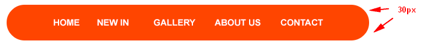
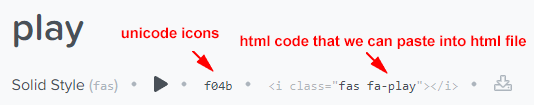
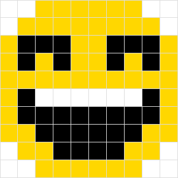

## Aufgabe 1 - zum Lösen mit dem Kursleiter

Einer Ihrer Kunden wünscht, dass die Kanten des Navigationsmenüs seiner Website (die Sie erstellt haben) nun doch nicht
eckig, sondern abgerundet sein sollen.

 

Erstellen Sie für das ***erste*** und ***letzte*** Menüelement (siehe Website `index.html`) eine Abrundung von `30px`.
 
Achten Sie dabei auf die Angabe der Werte in korrekter Reihenfolge (`oben-links oben-rechts unten-rechts unten-links`).

 

Definieren Sie außerdem ein ***padding*** von `40px` für die linke Seite des ersten `<li>`-Elements sowie für die rechte
Seite des letzten `<li>`-Elements.

 

Zum Schluss soll die Navigationsleiste folgendermaßen aussehen:

## Aufgabe 2 

Ein potenzieller Kunde beschwert sich, dass eine Tabelle auf seiner Website (siehe `index.html`) im aktuellen Zustand 
visuell stark zu wünschen übrig lässt.

 

Sie, als fortgeschrittene:r Webentwickler:in, werfen einen Blick auf die Website des Kunden und wissen sofort, was Sie
tun:

- Definition eines ***padding*** von `20px` für `<td>`-Zellen
- Abwechslungsreiches, ansprechendes Design: ***jede zweite Zeile der Tabelle*** erhält die Hintergrundfarbe `#eee`

## Aufgabe 3

Die vorgegebene Website (`index.html`) enthält zwei Button-Reihen mit Vektorsymbolen von 
[https://fontawesome.com/](https://fontawesome.com/).
 

> Anhand des ansprechenden Designs und des kurzen Codes, der dafür nötig ist, können Sie bestimmt nachvollziehen, wieso
> Vektorsymbole und ***fontawesome*** bei Entwickler:innen so beliebt sind :)

 

### Nun zu ihrer Aufgabe:

Sie sollen in der unteren Button-Reihe dieselben Icons einbinden, jedoch ***ohne `<i>`-Element und Verlinkung***!

 

Verwenden Sie die Suchmaschine von ***fontawesome*** 
([https://fontawesome.com/icons?d=gallery](https://fontawesome.com/icons?d=gallery)) und laden Sie die Icons in einen
eigenen Ordner (z.B. `icons/`).  
Schlagwörter für die gesuchten Icons sind `plus-circle`, `ban` und `play`

 

Binden Sie die heruntergeladenen Icons anschließend in die Buttons der unteren Reihe (Klasse `buttons-ver-2`) ein,
***ohne neue Tags zu definieren***.  
Verwenden Sie hierzu das Pseudoelement `::before`.

 

Um ein Icon via CSS einzubinden, gehen Sie folgendermaßen vor:
1. Definition der `font-family` `Awesome 5 Free` für das Zielelement, sodass Icons eingesetzt werden können (Verlinkung!)
2. Herausfinden des Unicode-Literals (siehe Bild unten)
3. Angabe des Unicode-Literals mit Escape-Sequenz (z.B. `\f04b` anstelle von `f04b`) als `content`-Eigenschaft des
Zielelements

 

 

Stellen Sie darüber hinaus eine Textgröße von `1.5em` für Icon-Zielelemente ein!

 

*Haben Sie alles richtig gemacht, sollte die untere Reihe genauso aussehen, wie die obere!*

## Aufgabe 4

Spielen Sie die ***Level 15 bis 26***: [flukeout.github.io](http://flukeout.github.io/)

## Aufgabe 5

Auf der vorgegebenen Seite (`index.html`) ist im `
`-Element mit der Klasse `.cnt` eine Matrix aus `<strong>`- und 
``-Elementen aufgebaut.

 

Formatieren Sie diese Matrix mithilfe von CSS so, dass folgendes Ergebnis entsteht:

 

***Wichtig***: Verwenden Sie keine Klassen oder IDs zur Selektion.  
Toben Sie sich aus - werfen Sie einen Blick in den Debugger, probieren Sie verschiedene Arten von Selektoren und
Pseudoklassen aus, usw.!
