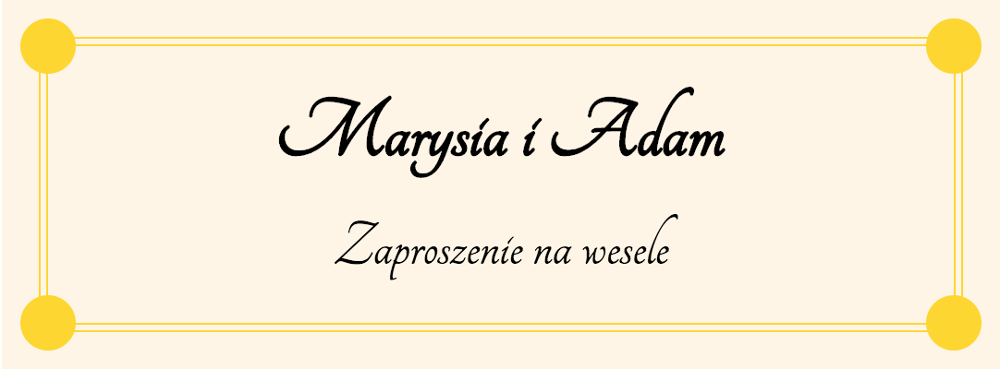

## Aufgabe 1 - zum Lösen mit dem Kursleiter

Formatieren Sie die Elemente der vorgegebenen Website (`index.html`) wie folgt, ***ohne HTML-Quellcode zu ändern***:

 

### Erster Absatz

- das Foto soll auf der ***linken*** Seite positioniert werden
- es soll auf der rechten Seite und am unteren Rand einen Abstand von `20px` zum Text haben
- es soll ***abgerundet*** sein.
- es soll `200x200px` groß sein

 

### Zweiter Absatz

- das Foto soll auf der ***rechten*** Seite positioniert werden
- es soll auf der linken Seite und am unteren Rand einen Abstand von `20px` zum Text haben
- es soll ***abgerundet*** sein.
- es soll `200x200px` groß sein

 

Die folgende Grafik zeigt die gewünschte finale Formatierung:

## Aufgabe 2 - zum Lösen mit dem Kursleiter

Die vorgegebene Website (`index.html`) enthält ein Element mit der Klasse `.card` - ein Beispiel einer
Hochzeitseinladungskarte.  
Diese enthält 4 ``-Elemente (Klassen `.dot--top-left`, `.dot--top-right`, `.dot--bottom-left` und 
`.dot--bottom-right`), die Eckpunkte im Design der Einladungskarte darstellen sollen.

 

Formatieren Sie nun diese ``-Elemente, wobei für jedes einzelne eingestellt werden soll:

- Hintergrundfarbe: `gold`,
- Breite und Höhe: `30px`,
- Darstellung als ***Block*** mit ***absoluter*** Positionierung, ***Abrundung*** bis zur Kreisform
- passende Platzierung in den Ecken (z.B. `.dot--left-top`: Positionierung `top: -15px`, und `left: -15px`)

Alle Punkte sollen hierbei in Bezug zum Element `.card__border` positioniert werden!

 

Erwartetes Ergebnis:

## Aufgabe 3

Die vorgegebene Website (`index.html`) enthält ein Element mit der Klasse `.image`.

 

Erzeugen Sie mithilfe von Pseudoelementen das folgende Layout:

 

Die Pseudoelemente sollen hierbei `50x50 px` groß sein und die Hintergrundfarbe `mediumblue` haben.  
Der Rand des Elements mit der Klasse `.image` soll `5px` breit sein und in der Farbe `tomato` eingefärbt sein.

## Aufgabe 4

Die Datei `index.html` enthält Quellcode zur Darstellung eines Vorschaubildes (eines Projekts).

 

Versuchen Sie nun, das hier gezeigte Design nachzubauen:

 

Das gezeigte Overlay ist in der Farbe `tomato` eingefärbt - Sie können nach erfolgreicher Implementierung auch
probeweise auf ein sanftes Blau (`rgba(0, 128, 255, 0.5)`) wechseln!