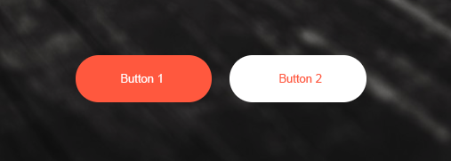

## Hausaufgabe - 1

Die vorgegebene Website (`index.html`) enthält ein kleines Navigationsmenü.

Formatieren Sie dieses Navigationsmenü, sodass es final so aussieht:

 

### Vorgaben

- Hintergrundfarbe des Navigationsmenüs: `#F15C5C`
- Schriftart: `Pacifico` in der Größe `20px` (siehe ***Google Fonts***)
- Abstand von `20px` zwischen Menüelementen
- Abstand von `20px` zwischen Elementen und dem Rand des Navigationsmenüs
- ***Kein fixer Abstand*** zwischen Menü und anderen Elementen
- Links des Navigationsmenüs werden bei *Überfahren mit der Maus* in der Farbe `#333` eingefärbt
- Elemente des Navigationsmenüs werden mittels `display: inline-block` nebeneinander angeordnet

## Hausaufgabe - 2

Die vorgegebene Website (`index.html`) enthält ein einfaches Banner (ja, es heißt ***das*** Banner!).

Formatieren Sie dieses Banner, sodass es final so aussieht:

Vorgaben:
- Höhe: `600px`
- Hintergrund: Bild unter `images/car-background.jpg`
- Schriftart: `Oswald` (siehe ***Google Fonts***!)
- Textgröße: `60px`, Dicke: `600`
- das Wort ***Sharing*** soll in der Farbe `orangered` eingefärbt sein
- der Textzug soll horizontal wie vertikal zentriert sein

Darüber hinaus ist die Hintergrundgrafik leider ***zu hell*** und muss daher *verdunkelt* werden.  
Definieren Sie hierzu ein Pseudoelement `::before`, das 
- ***absolut*** positioniert wird
- die Hintergrundfarbe `#111` und die Transparenz `0.5` hat

Der Text soll dabei trotzdem sichtbar bleiben (***Tipp***: `z-index`).

## Hausaufgabe - 3

Die vorgegebene Website (`index.html`) enthält zwei Buttons.

Formatieren Sie die Seite so, dass sie folgendes Design erhalten:
 

 

Vorgaben:

- die Buttons besitzen keinen Rahmen
- die Buttons haben als Cursor den ***"Zeigefinger"*** (bei *Überfahren mit der Maus*)
- *oben* und *unten* haben die Buttons einen Abstand von `20px`, *links* und *rechts* einen Abstand von `50px`
- die Ecken der Buttons sind in einem Radius von `35px` abgerundet
- die rote Farbe der Buttons ist `tomato`
- zwischen den Buttons soll zumindest ein Abstand von `10px` sein
