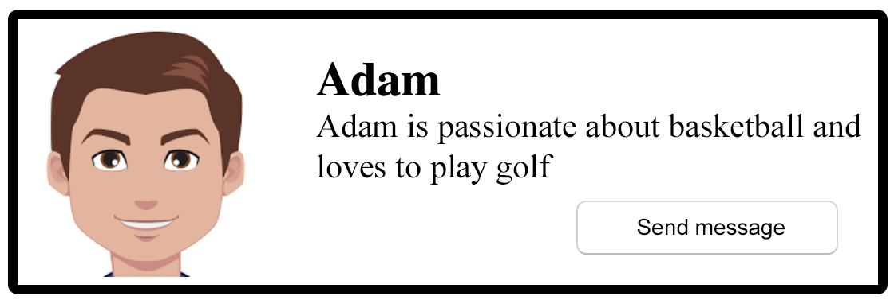
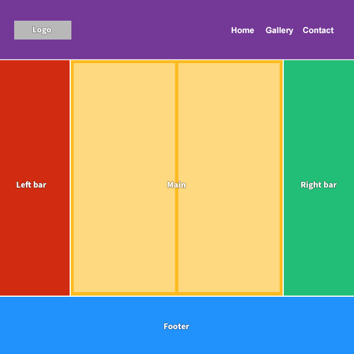
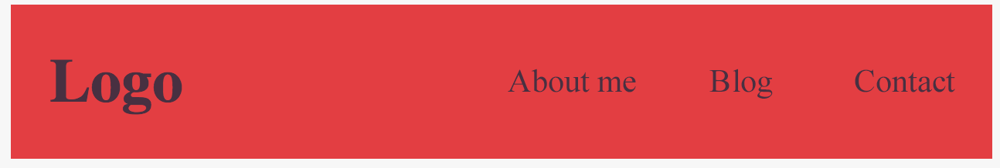
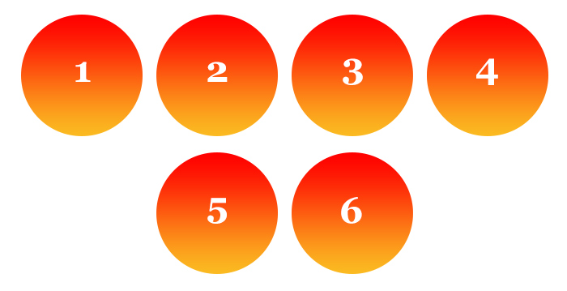

## Avatarbox - zum Lösen mit dem Kursleiter

Bauen Sie mittels `flexbox` das folgende Layout im gegebenen Webprojekt selbstständig nach (erstellen der benötigten 
Elemente, Grundformatierung, Verlinkungen, etc.):

 

### Vorgaben

* Das Bild ist vertikal zum Text zentriert
* Die Schaltfläche `Nachricht senden` befindet sich in der unteren rechten Ecke der Box (verwenden Sie hierfür 
ausschließlich `flexbox`)

## Holy Grail - zum Lösen mit dem Kursleiter

> Der ***Holy Grail*** ist nicht irgendein Kelch, sondern ein als "schön" angesehenes Websitelayout (siehe Grafik unten).
>    
> Bislang gab es keinen symantisch korrekten und darüber hinaus einfachen Ansatz, ein solches Layout mit HTML und CSS
> zu implementieren - `flexbox` brachte hierfür die erste vollständige Lösung.

 

Was damals ein echter *CSS-Jedi* mittels unzähliger `float` und anderen CSS-Eigenschaften mühselig zusammenstöpseln
musste ist heute mit `flexbox` fast schon ein Kinderspiel!

 

Bauen Sie das folgende Layout im gegebenen Webprojekt mithilfe von `flexbox` selbstständig nach:

## Flexbox Froggy

Spielen Sie alle (womöglich noch offenen) Kapitel von [Flexbox Froggy](https://flexboxfroggy.com/).

## Navigation

Mittlerweile sind Sie regelrechter flexbox-Profi!  
Bauen Sie folgendes Layout im gegebenen Webprojekt mittels flexbox selbstständig nach:

 

### Vorgaben

* Verwenden Sie **ausschließlich** `flexbox` zur Anordnung der Elemente (nebeneinander)
* Das Logo und die Navigationsbuttons sollen *möglichst weit* von einander entfernt sein
* Logo und Navigationsbuttons sollen vertikal (in der Höhe) zentriert sein

**Außerdem**:

* Hintergrundfarbe: `#E53C3D`
* Textfarbe: `#492F41`

##  Design-Boxen

Erstellen Sie folgendes Layout im gegebenen Webprojekt:

## Feuer-Kreise

Ihre nächste Aufgabe ist es, die untenstehende Grafik zu reproduzieren:

Erstellen Sie ein `.circles`-Element (bspw. eine `<section>`), in dem Sie 6 Kreise (z.B. als `
`) platzieren. Jeder
Kreis sollte folgende Eigenschaften haben:

- Größe: `150x150`
- einen vertikal und horizontal zentrierten Text (`flexbox`) in der Schriftgröße `40px`
- Abstand zu anderen Kreisen: `10px`.
- Gradientenhintergrund-Übergang von `red` auf `#FBB921`

**Die Kreise sollen horizontal zentriert sein und sich untereinander anordnen, wenn sie nicht horizontal passen.**

