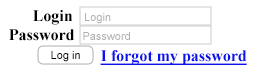
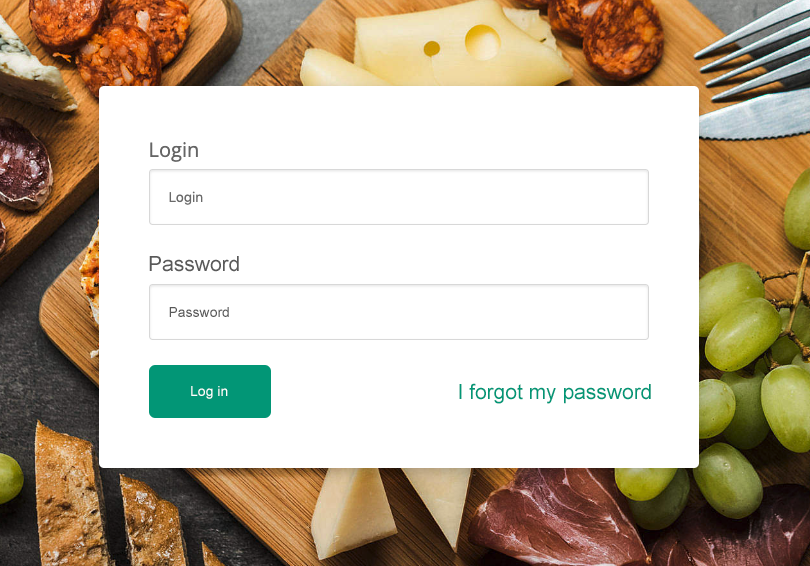

## Aufgabe zum Lösen mit dem Kursleiter

Erstellen Sie im gegebenen Webprojekt ein **Formular** mit den folgenden Komponenten:

#### Eingabefeld ***Login***
  - Eingabetyp `text`
  - Platzhalter `Login`
  - formularinterne Bezeichnung `Login`

#### Eingabefeld ***Password***
  - Eingabetyp `password`
  - Platzhalter `Password`
  - formularinterne Bezeichnung `Password`

#### Button ***Login***
  - Elementtyp `Button`, Eingabetyp `submit`
  - Textzug `Log in`

 

Zusätzlich soll am unteren Ende des Formulars die Passwordwiederherstellung über den Link `I forgot my password` 
erreichbar sein (dieser Link zeigt für dieses Beispiel nach `#`).

 

Allein durch die Verwendung der semantisch korrekten Formularelemente sowie der Definition der korrekten 
Elementattribute (***bei keiner CSS-seitigen Formatierung!***) sollte Ihr Ergebnis so aussehen:
 

---

## Aufgaben zum selbständigen Lösen

Formatieren Sie nun das gerade erstellte Formular so, dass es wie jenes auf der folgenden Grafik aussieht:

 

***Vorab***: Definieren Sie Klassen (so viele, wie sinnvoll und nötig!) für die bestehende Struktur - halten Sie die
Dinge so einfach, wie möglich!

 

#### Schritt 1

Beginnen Sie mit der Einbindung des Hintergrundbilds und der Zentrierung des Formulars.

Definieren Sie hierfür folgende Eigenschaften für das `<body>`-Element:

- Hintergrundbild: `images/background.jpg`
- Skalierung des Hintergrundbilds, sodass ***die gesamte Fläche*** abgedeckt wird
- *Zentrierung* des Hintergrunds
- *Deaktivierung von Wiederholungen* des Hintergrunds

 

Machen Sie das `<body>`-Element zu einem `flex`-Element und zentrieren Sie dessen Inhalt in beiden Achsen!

---

#### Schritt 2

Als nächstes formatieren Sie das Formular selbst.  
Stellen Sie hierfür folgende Eigenschaften ein:

- Hintergrund: `white`
- Abrundung der Ecken: `4px`
- Schattierung: `0 3px 10px rgba(0, 0, 0, 0.2);`
- inneren Abstand zum Rand: `40px`

---

#### Schritt 3

Formatieren Sie nun die Eingabeelemente des Formulars mit den folgenden Eigenschaften:

- innerer Abstand: `15px`
- Rahmen: Stärke `1px`, Typ `solid` und Farbe `#ddd`
- Abrundung der Ecken: `3px`
- Schattierung (***nach innen!***): `0 1px 2px rgba(0, 0, 0, .1)`
- ge**block**t im Elementfluss
- Breite: `400px`
- verhindern Sie über die Eigenschaft `box-sizing`, dass das `padding` anwachsen kann

---

#### Schritt 4

Nun ist der Login-Button an der Reihe.

Definieren Sie für den `button` folgende Eigenschaften:

- Hintergrundfarbe: `#05A081`
- innerer Abstand: `15px 30px`
- Anzeigeart: `inline-block`
- Textfarbe: `white`
- **kein** Rand
- Abrundung der Ecken: `5px`

---

#### Schritt 5

Zum Abschluss muss noch der "Passwort vergessen"-Link formatiert werden.

Verwenden Sie *flexbox* (im Idealfall in einem Containerelement über Button und Link), um:
- beide jeweils an die Enden der Hauptachse zu verlegen
- beide in der vertikalen Achse zu zentrieren
---

***Außerdem***: Formatieren Sie, wenn das Layout fertig ist, die Elemente des Formulars im Details so, wie Sie es aus
der Angabegrafik ableiten können (Schriftarten, Placeholder-Formatierung, etc.)!
