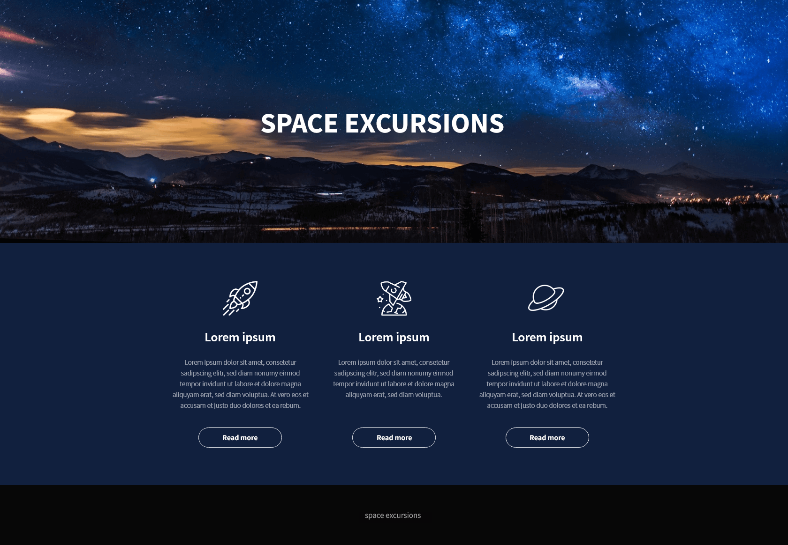
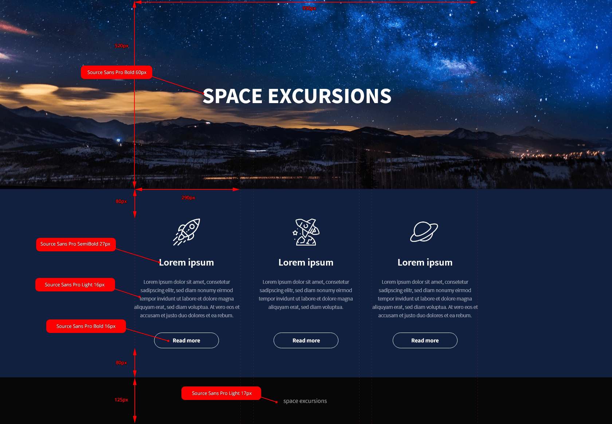

## Aufgabe 1 - zum Lösen mit dem Kursleiter

Die Aufgabeninhalte sind der vorangehenden Präsentation zu entnehmen.

 

Verwenden Sie die Ordnerstruktur dieser Aufgabe für Ihre Ausarbeitung.

## Aufgabe 2

Erstellen Sie in der gegebenen Ordnerstruktur selbstständig folgende Website:

 

Ein paar Hilfestellungen, um das Layout genauer hinzubekommen:

 

### Vorgaben

- Verwenden Sie die Schriftart [Source Sans Pro (Google Fonts)](https://fonts.google.com/specimen/Source+Sans+Pro) 
- Der eigentliche Seiteninhalt ist `930px` breit, der Seitenhintergrund füllt die gesamte Seitenbreite
- Die benötigten Icons und Grafiken befinden sich bereits im Verzeichnis `images/`
- Die Hintergrundfarbe der Seite ist `#11203E`
