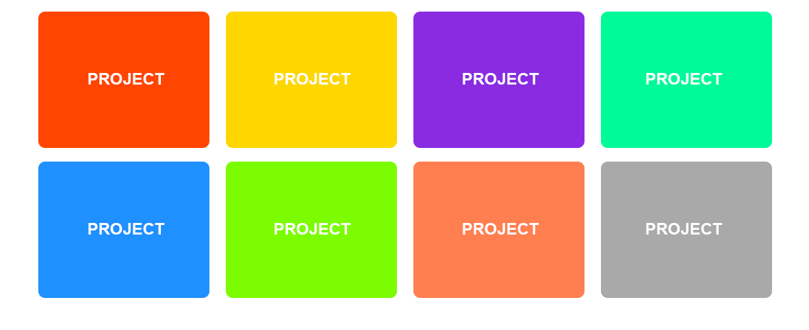

## Hausaufgabe - Bunte Kacheln

Gestalten Sie die vorgegebene Website (`index.html`), sodass sie folgende Minigalerie aus "Projektkacheln" erzeugen:

 

### Vorgaben

- Kacheln haben Abmessungen von `250x200px`
- Kacheln haben um `10px` abgerundete Ecken
- Der Text innerhalb einer Kachel ist in der Schriftart `sans-serif` mit der Größe `20px` und in der Farbe `white`
  formatiert
- Die Kacheln sollen, soweit möglich, nebeneinander angezeigt werden. Bei Verkleinern des Anzeigefensters sollen sie in
  die nächste Zeile umgebrochen werden.

 

Farblich sollen die Kacheln - in Reihenfolge - folgendermaßen eingefärbt werden:

- orangered
- gold
- blueviolet
- mediumspringgreen
- dodgerblue
- lawngreen
- coral
- darkgray

## Flexbox Defense

Spielen Sie alle (womöglich noch offenen?) Levels des Spiels [Flexbox Defense](http://www.flexboxdefense.com/) durch!

## Hausaufgabe

Im Zuge dieser Aufgabe erstellen Sie folgende Website:

 

- Beginnen Sie mit der Definition eines CSS-Resets (der kurze Reset aus dem Theorieteil ist ausreichend).
- Binden Sie die Font [Bungee Inline](https://fonts.google.com/specimen/Bungee+Inline) aus Google Fonts ein.
- Fügen Sie dem `<body>` die folgenden drei Elemente hinzu:
    - `<header>`
    - `<section>`
    - `<footer>`

 

- Erstellen Sie die Klasse `.container`, für deren Elemente gelten soll:
    - Breite: `800px`
    - horizontale Zentrierung
       
- Definieren Sie für das `<header>`-Element folgende Eigenschaften:
    - Breite: `100%`, Höhe: `700px`
    - Hintergrundbild: `images/concert.jpg`, zentriert und stets das Element füllend (Eigenschaften `background-size`
      und `background-position`)
       
- Erstellen Sie im Element `<header>` die Titelüberschrift, **zentrieren** Sie diese **horizontal und vertikal**
  gegenüber dem Elternelement und definieren Sie folgende Eigenschaften:
    - Fontgewicht: `700`
    - Fontgröße: `50px`
    - Schriftfarbe: `#FFFFFF`
       
- Sorgen Sie für eine Breite von `100%` und die Hintergrundfarbe `#FFFFFF` für das `<section>`-Element
   
- In der Datei `text.txt` finden Sie einen Platzhaltertext für die `<section>`.  `<section>` wird als
  Containerelement über die Eigenschaften der Klasse `.container` gestylt!
- Der Text soll nach oben und unten einen Abstand von jeweils `100px` haben und folgendermaßen formatiert sein:
    - Fontgewicht: `400`
    - Fontgröße: `22px`
    - Linienhöhe: `26px`
       
    - Der `<footer>` soll folgendenmaßen gestylt werden:
        - Breite: `100%`, Höhe: `200px`
        - Hintergrundfarbe: `#000000`
    - Der Text innerhalb des Footers soll **vertikal zentriert** sein und **so weit rechts wie möglich** angeordnet
      sein (Beschränkung erst durch `.container`!)
    - Der Text innerhalb des Footers soll folgendermaßen formatiert sein:
      - Fontgewicht: `400`
      - Fontgröße: `20px`
      - Schriftfarbe: `#FFFFFF`
      