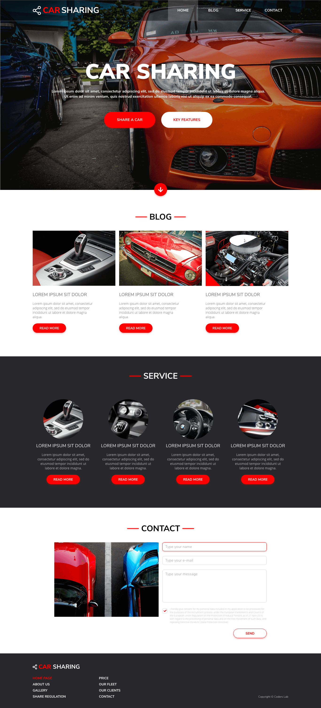

# Car Sharing

[Ansicht des Adobe XD-Prototyps](https://xd.adobe.com/view/19f36565-a886-47a4-45e4-47c2d02e4a8f-6fc2/).

 

## Containers

Das Containerelement mit der Klasse `.container` ist `1088px` hoch und soll den gesamten Seiteninhalt beinhalten.

 

## Fonts

Folgende Schriftarten sind über Google Fonts einzubinden:
- `Nunito Sans`
- `Open Sans`

Die verwendeten Farben sind dem Adobe XD-Prototyp zu entnehmen!

 

## Grafiken

Die verwendeten Bilder, Symbole und Grafiken sollen im Ordner `images/` abgespeichert werden.  
Beziehen Sie diese ebenfalls aus dem Adobe XD-Prototyp!

 

## Ablauf der Implementierung

### Vorbereitende Aufgaben - zu lösen mit Ihrem Kursleiter (siehe Präsentation)
1. Erstellung und Vorbereitung eines Repositories für dieses Projekt
2. Aufbau einer grundlegenden Ordner- und Dateistruktur für das Projekt
3. Download und Ablage von `normalize.css`
4. Erstellung des HTML-Dokuments (`index.html`)

 

### Selbstständig zu lösende Aufgaben (siehe Präsentation)
1. Analysiere von Merkmalen der Website (aus Angabebildern)
2. Vorbereitung von benötigten Farben, Schriftarten, Abständen, etc.
3. Unterteilung der Implementierung in übersichtliche Einzelschritte
4. Schrittweise Implementierung der HTML-Struktur, gefolgt von schrittweiser CSS-Formatierung

 

