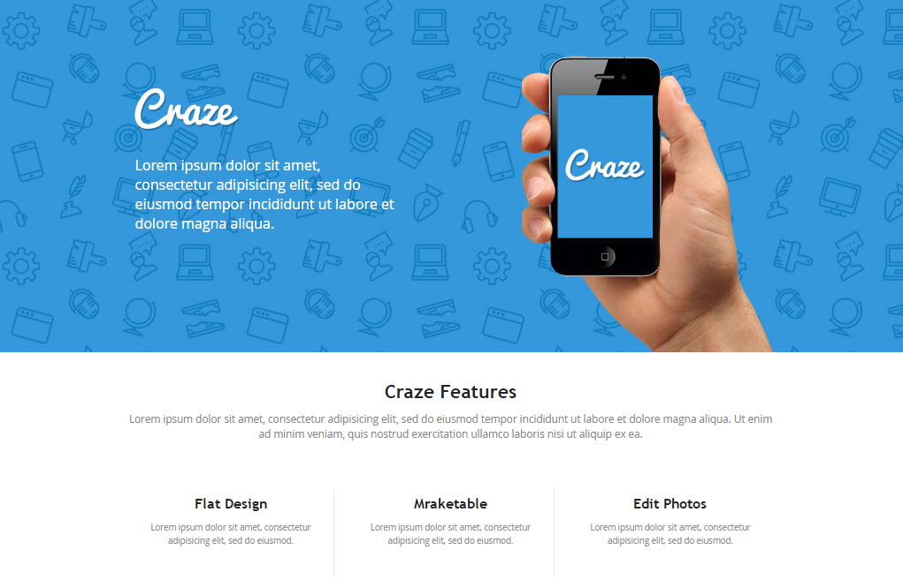

## Bauen Sie die hier abgebildete Website nach

 

## Eigenschaften im Detail

- Es wird der Font `Open Sans` verwendet.   Generieren Sie benötigte Dateien mit `FontSquirrel` und binden Sie diese
  im Projekt ein. und fügen Sie diese in das Projekt ein).
- Alle benötigten Bilddateien sind im Verzeichnis `images/` enthalten.

 

- Breite des zentralen Containerelements: `930px`

 

- Schriftgrößen und -farben:
  - ***Text im `<header>`***: `24px`, `white`
  - ***Kopfzeile Craze Features***: `30px`, `#232323`
  - ***Text unter Kopfzeile***: `18px`, `#838383`
  
   
  
  - ***Texte der drei Spalten***: 
    - Kopfzeile: `24px`, `#232323`
    - Flusstexte: `16px`, `#838383`

 

## Brauchen Sie Hilfe?

* [FontSquirel - Open Sans](http://www.fontsquirrel.com/fonts/open-sans)
