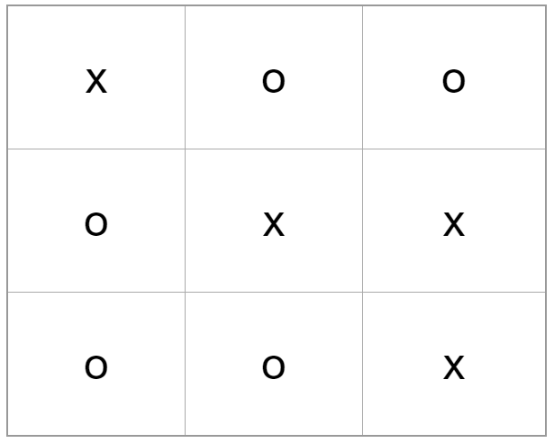

## Tic-Tac-Toe - Durchgehende Reihe gewinnt (Tabelle 3x3)

> Öffnen Sie die Datei `index.html` im jeweiligen Aufgaben-Ordner auf **github.com** (Anklicken der Datei). Dies dient als **Vorschaumodus**. 
> Öffnen Sie die gleiche Datei aus dem geklonten Repository Ihres PC´s mittels Code-Editor Ihrer Wahl (WebStorm, Visual Studio Code). In diesem führen Sie, wie unten beschrieben, die Aufgabe aus - **Bearbeitungsmodus**.

Der CSS-Code zu dieser Aufgabe ist bereits fertig. Versuchen Sie, mit Hilfe von HTML eine solche Tabelle auf der Seite umzusetzen:

## Kalender in der Monatsansicht (Tabelle)

> Öffnen Sie die Datei `index.html` im jeweiligen Aufgaben-Ordner auf **github.com** (Anklicken der Datei). Dies dient als **Vorschaumodus**. 
> Öffnen Sie die gleiche Datei aus dem geklonten Repository Ihres PC´s mittels Code-Editor Ihrer Wahl (WebStorm, Visual Studio Code). In diesem führen Sie, wie unten beschrieben, die Aufgabe aus - **Bearbeitungsmodus**.

Der CSS-Code zu dieser Aufgabe ist bereits fertig. Versuchen wir mit Hilfe des HTML-Codes eine Monatsansicht in tabellarischer Form umzusetzen:

